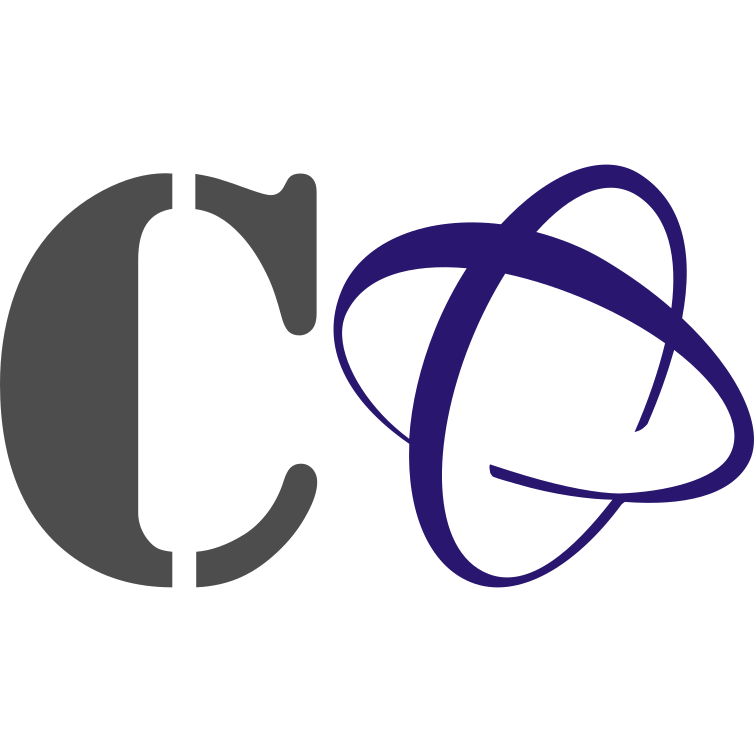

# Cursos 0

{: width="100" }

**Página principal de los cursos 0 de la Facultad de Ciencias de la Universidad de Granada**

Este Proyecto de Innovación Docente  tiene como objetivo principal,
consolidar y potenciar los Cursos Cero en las materias básicas que se imparten en los
diferentes Grados de la Facultad de Ciencias de la Universidad de Granada. 

Esta iniciativa responde a la necesidad expresada tanto por estudiantes como por el
profesorado de primeros cursos, de potenciar unos contenidos docentes implementados
en un formato Curso Cero en línea, flexible y modular, que actúe como elemento
facilitador en la adaptación del nivel curricular de los estudiantes con formación menos afín
a dichas materias básicas. Además, la solicitud de este proyecto se sustenta en las
recomendaciones incluidas por los Evaluadores en los recientes Informes para la
renovación de la Acreditación de varios Títulos de Grado de la Facultad de Ciencias en
las que, de manera explícita, se instaba a potenciar los Cursos Cero.

Para el desarrollo de las actividades propuestas se ha conformado un equipo de trabajo
mixto, multidisciplinar y equilibrado, con representación de profesorado experto en
docencia de primeros cursos en las materias básicas, bajo la coordinación del Decanato
de la Facultad. 

Este proyecto se solicitó bajo el convencimiento de que su puesta en marcha servirá para
paliar las deficiencias en la formación de los alumnos de primer curso de la Facultad de
Ciencias de la Universidad de Granada detectadas por docentes y evaluadores.

Éstos son los cursos disponibles. 

- [Biología](https://cursos-0-fc-ugr.github.io/Biologia)
- [Expresión Gráfica](https://cursos-0-fc-ugr.github.io/Expresion-Grafica)
- [Física](https://cursos-0-fc-ugr.github.io/Fisica)
- [Geología](https://cursos-0-fc-ugr.github.io/Geologia)
- [Matemáticas](https://cursos-0-fc-ugr.github.io/Matematicas)
- Los contenidos de química están alojados en el siguiente [moodle](https://fciencias.ugr.es/cursoscero/login/index.php). Si estudias en la Universidad de Granada y quieres tener acceso a estos contenidos, escribe al [vicedecano de Calidad e Innovación Docente](https://fciencias.ugr.es/facultad/equipo-de-gobierno) de la Facultad de Ciencias.

 Si detectan algún error, por favor, utilicen la plataforma de *informe de errores* del curso correspondiente.
 
Los contenidos de estos cursos forman parte del FIDO “IMPLEMENTACIÓN DE CURSOS CERO EN LA PLATAFORMA PRADO2 PARA LAS TITULACIONES DE LA FACULTAD DE CIENCIAS” de la Convocatoria de Proyectos de Innovación Docente y Buenas Prácticas del Plan FIDO UGR 2016-2018 (Universidad de Granada), y del PID “MANTENIMIENTO Y MEJORA DE LOS CURSOS CERO DE LA FACULTAD DE CIENCIAS”, de la Convocatoria de Proyectos de Innovación y Buenas Prácticas Docentes 2018/2020, en la modalidad de proyectos Coordinados
